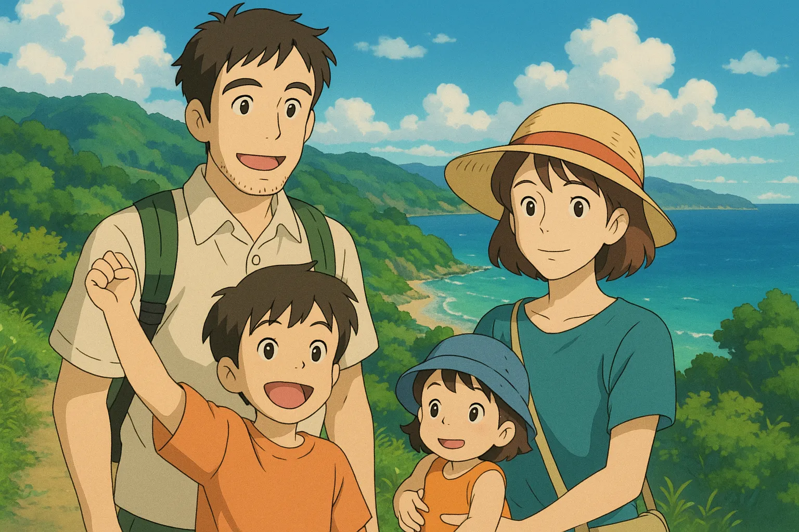
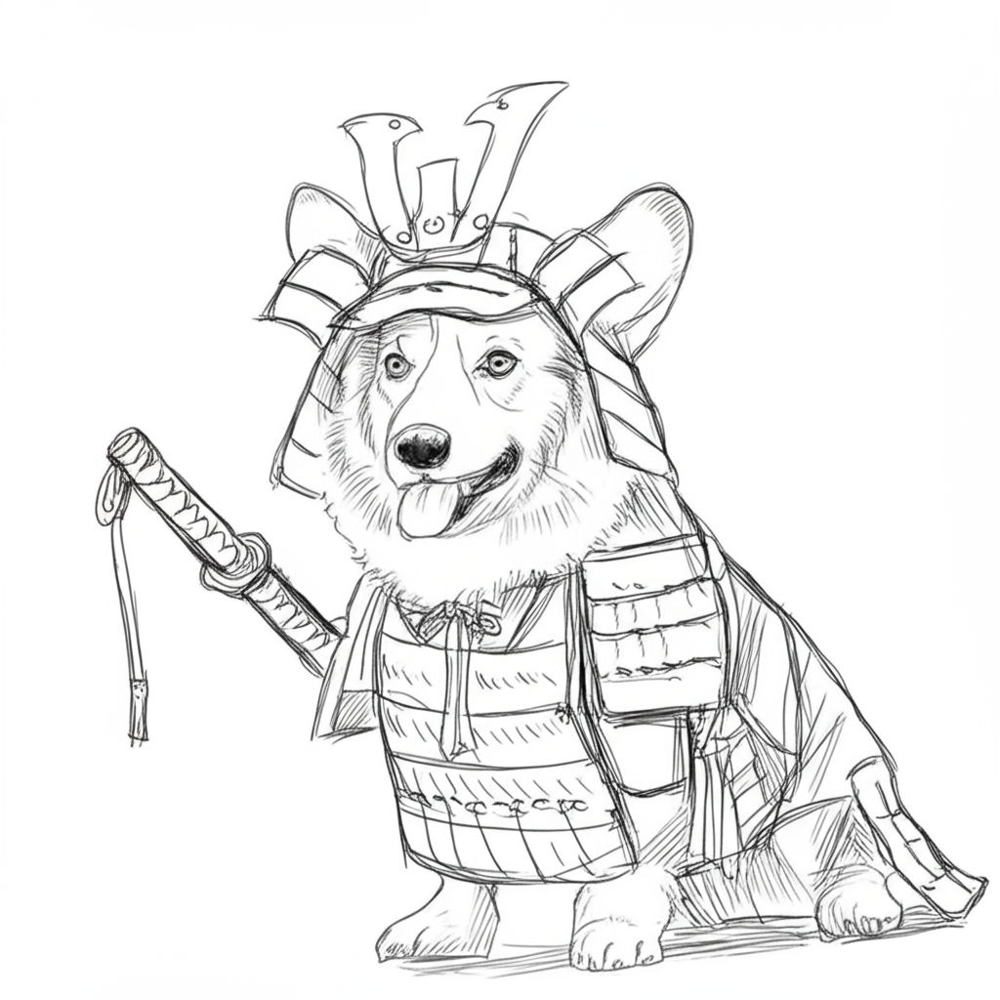
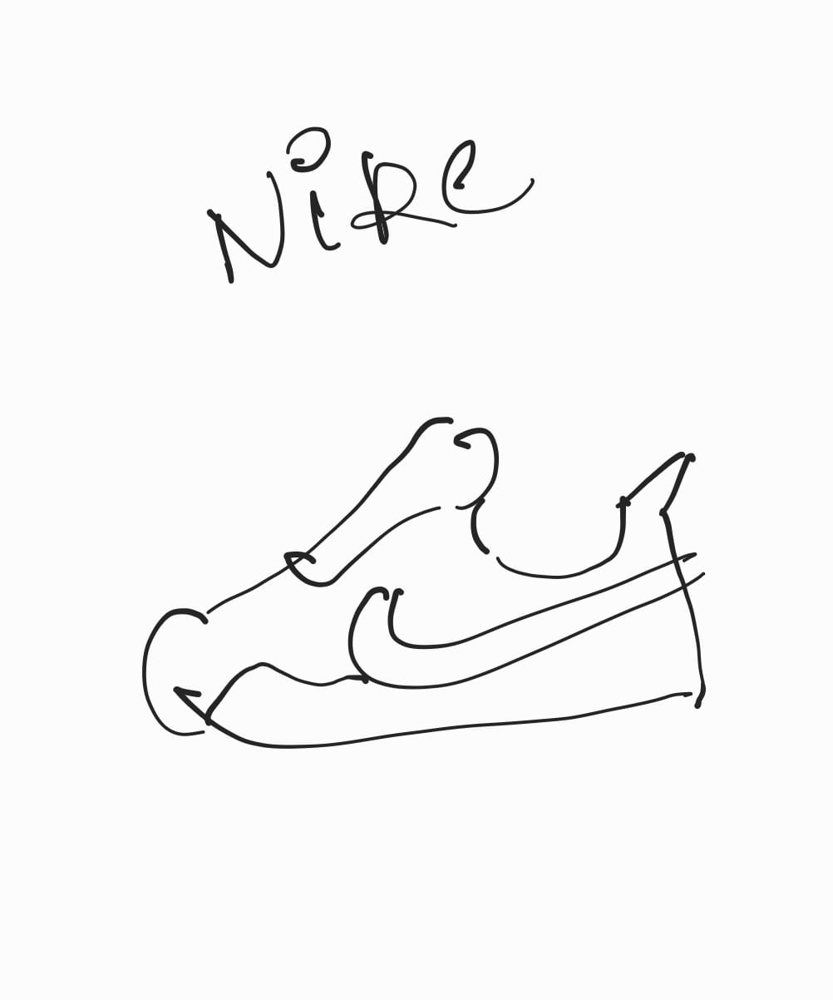
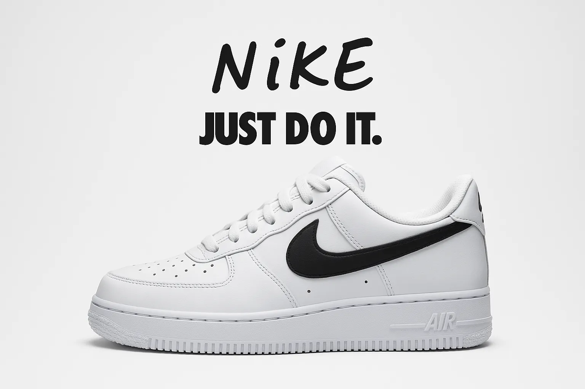

# 🎨 Quotica - AI-Powered Visual Creator

> Transform your ideas into stunning visuals with cutting-edge AI technology

Quotica is a powerful web application that turns your imagination into professional-quality images. Whether you're creating Studio Ghibli-style artwork, marketing materials, or artistic compositions, our platform makes it easy to generate exactly what you envision.

---

## ✨ What Makes Quotica Special

### 🤖 Dual AI Engines

- **GPT-Image-1**: OpenAI's advanced model for superior creativity and detail
- **Gemini Image Gen 3**: Google's latest technology for diverse artistic styles

### 🎭 Unlimited Creative Possibilities

- **Studio Ghibli Style**: Whimsical, hand-drawn animations
- **Professional Advertisements**: Marketing-ready visuals
- **Artistic Compositions**: Abstract and creative designs
- **Photorealistic Images**: Life-like photography
- **Custom Styles**: Whatever you can imagine!

### ⚡ User Experience

- Intuitive interface designed for creators
- Lightning-fast generation (30-60 seconds)
- High-resolution outputs ready for professional use
- No design experience required

---

## 🖼️ See the Magic in Action

### 🌟 Studio Ghibli Style Creation

**Prompt:** _"Generate an image of a family of four (two parents and two children) on vacation, standing together with mountains and beach in the background, illustrated in Studio Ghibli style. The scene should feel warm, peaceful, and slightly nostalgic."_



---

### 🎌 Creative Character Design

**Prompt:** _"Generate a sketch-style illustration of a corgi wearing a traditional samurai outfit. The drawing should focus on line work and shading, with a hand-drawn, monochrome look. The corgi should have a confident stance, with armor pieces like shoulder guards, a katana strapped to its side, and a small topknot helmet."_



---

### 📸 Photo-to-Advertisement Magic

Transform your everyday photos into professional marketing materials!

#### Before: Original Photo



#### After: AI-Generated Advertisement

**Prompt:** _"Transform this photo into a real world advertisement for Nike shoes"_



---

## 🚀 How to Create Amazing Images

### Step 1: Craft Your Prompt

Be specific and descriptive. Include:

- **Subject**: What's the main focus?
- **Style**: Ghibli, realistic, abstract, etc.
- **Mood**: Peaceful, energetic, mysterious
- **Details**: Colors, lighting, composition

### Step 2: Choose Your AI Model

- **GPT-Image-1**: Best for creative and artistic styles
- **Gemini Image Gen 3**: Excellent for realistic and diverse outputs

### Step 3: Generate & Refine

- Click generate and wait 30-60 seconds
- Download in high resolution
- Refine your prompt if needed

---

## 💡 Perfect Use Cases

| Use Case                    | Why Quotica is Perfect                                     |
| --------------------------- | ---------------------------------------------------------- |
| **🎯 Marketing Campaigns**  | Create eye-catching visuals without expensive photo shoots |
| **📱 Social Media Content** | Generate unique posts that stand out in feeds              |
| **🎨 Creative Projects**    | Explore artistic concepts and bring ideas to life          |
| **📖 Content Creation**     | Illustrate blogs, articles, and presentations              |
| **🎁 Personal Gifts**       | Create custom artwork for friends and family               |

---

## 🔧 Technology Stack

Built with modern, reliable technologies:

### Frontend

- **Next.js 14** with App Router
- **React 19** for dynamic interfaces
- **TypeScript** for type safety
- **Tailwind CSS** for responsive design
- **shadcn/ui** for beautiful components

### AI Integration

- **OpenAI GPT-Image-1** - Advanced image generation
- **Google Gemini Image Gen 3** - Cutting-edge visual AI
- **Optimized Processing** - Fast, efficient rendering

---

## 📝 Prompt Writing Tips

### ✅ Great Prompts Include:

```
"A cozy coffee shop interior with warm lighting, vintage furniture,
plants hanging from the ceiling, and a barista preparing coffee.
Studio Ghibli animation style with soft colors and detailed textures."
```

### ❌ Avoid Vague Prompts:

```
"Nice picture of a coffee shop"
```

### 🎯 Pro Tips:

- **Be specific**: Instead of "dog," try "golden retriever puppy"
- **Set the mood**: "cheerful," "mysterious," "peaceful"
- **Mention style**: "Studio Ghibli," "photorealistic," "watercolor"
- **Add context**: "in a forest," "at sunset," "with friends"

---

## 🌟 Example Prompts to Try

### 🎨 Artistic Styles

```
"A mystical forest with glowing mushrooms and fireflies, painted in watercolor style with soft, dreamy colors"

"Abstract geometric patterns inspired by Art Deco, featuring gold and deep blue colors with sharp angles and flowing curves"
```

### 🏞️ Scenic Landscapes

```
"A peaceful mountain lake at sunrise, with mist rising from the water and snow-capped peaks in the background, photorealistic style"

"A bustling Tokyo street at night with neon signs reflecting on wet pavement, cyberpunk aesthetic with vibrant colors"
```

### 👥 Character Designs

```
"A wise old wizard with a long white beard, wearing star-patterned robes, holding a glowing staff in a magical library"

"A group of diverse friends having a picnic in a sunny park, illustrated in a warm, friendly cartoon style"
```

---

## 📄 License & Credits

This project is licensed under the **MIT License** - see the LICENSE file for details.

### 🙏 Built With Love Using:

- [Next.js](https://nextjs.org/) - The React framework for production
- [Tailwind CSS](https://tailwindcss.com/) - Utility-first CSS framework
- [shadcn/ui](https://ui.shadcn.com/) - Beautiful, accessible components
- [OpenAI](https://openai.com/) - GPT-Image-1 AI technology
- [Google Gemini](https://deepmind.google/technologies/gemini/) - Advanced AI capabilities

---

<div align="center">

**Ready to bring your ideas to life?**

[Start Creating →](https://quotica.fun)

Made with ❤️ for creators everywhere

</div>
